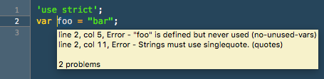

# XO.tmbundle



JavaScript happiness style on-save in TextMate 2.

Use [XO](https://www.npmjs.com/package/xo) to manage your project's coding style, and make sure each save is conforming to style rules.

## Install/Update

Recommended installation is via `tmb`, the [TM Bundles manager](https://github.com/elia/tmbundle-manager).

```shell
$ tmb install claylo/XO
```

Stay current with:

```shell
$ tmb update XO
```

If that's not your thing, you may also install directly from `git`.

```shell
cd ~/Library/Application\ Support/Avian/Bundles
git clone git://github.com/claylo/XO.tmbundle.git
```

## Prerequisites

Before using this bundle, you must ensure that XO is installed on your system. You may install XO globally, or in your project. These steps demonstrate installing it globally.

 1. Install [Node.js](http://nodejs.org)
 2. Install XO

```shell
$ npm install --global xo
```

## Customizing XO Execution

If configuration for XO is stored in the project's `package.json` file, XO.tmbundle will pick up that configuration correctly (as of v1.1.0). If XO control is needed but not desired in `package.json`, the `TM_XO` and `TM_XO_OPTIONS` bundles are supported in any `.tm_properties` file. For example:

    TM_XO = "$TM_PROJECT_DIRECTORY/node_modules/.bin/xo"
    TM_XO_OPTIONS = "--space --esnext"
    
Without `TM_XO` specified, `/usr/bin/env xo` is used to run the command.

## License

ISC @ [Clay Loveless](http://about.me/claylo)